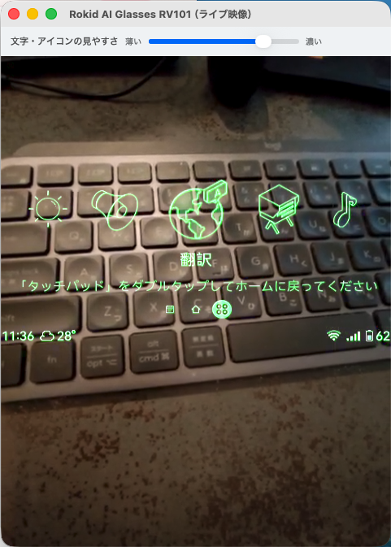
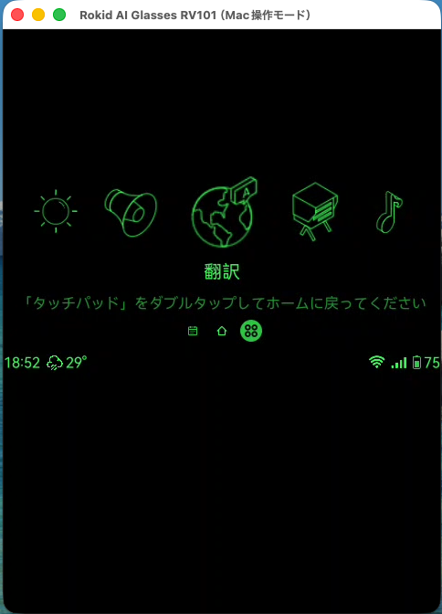

# Rokid Control for Mac

Rokid AI Glasses RV101の画面をMacに表示し、Macのマウスとキーボードで操作するアプリです。


**現在のバージョン: 1.2.6**

[変更履歴を見る](CHANGELOG.md)

## できること

- Rokidの画面をMacに表示する
- MacのマウスとキーボードでRokidを操作する
- 「ライブ映像」と「背景なし（省電力）」を選べる
- USBとWi-Fiの両方で接続できる
- Photo to Mac、純正「カメラ」、Rokid ZOOM IN CAMERA、テンプル右上ボタンの4つの撮影方法が使える

### ライブ映像

Rokidのカメラ映像を背景にして、Rokidの文字やアイコンを重ねて表示します。見やすさは画面上部のスライダーで調整できます。キーボードの操作案内もウインドウ上部の専用欄に表示するため、ライブ映像を隠しません。

純正「カメラ」または[Rokid ZOOM IN CAMERA](https://github.com/ksuzukigh/rokid-zoom-in-camera)を開くと、撮影画面のカラー映像へ自動で切り替わります。カメラを閉じると、元のライブ映像へ自動で戻ります。



### 背景なし（省電力）

通常はカメラを使わず、黒い背景にRokidの文字やアイコンを表示します。純正「カメラ」またはRokid ZOOM IN CAMERAを開いている間だけ、Mac表示がフルカラーの撮影画面へ切り替わります。



### 4つの撮影方法が使える

Rokid Controlを開いたまま、用途に合わせて4つの撮影方法を使い分けられます。「ライブ映像」と「背景なし（省電力）」のどちらでも撮影できます。

**緑のHUDでも、カメラアプリの撮影画面はフルカラー**

RokidのHUD（文字・アイコン）は緑1色ですが、純正「カメラ」またはRokid ZOOM IN CAMERAを開くと、「ライブ映像」と「背景なし（省電力）」のどちらでもMac表示がフルカラーの撮影画面へ自動で切り替わります。カメラアプリを閉じると、選んでいた表示モードへ自動で戻ります。

**Photo to Macとは？**

[Photo to Mac](https://github.com/ksuzukigh/rokid-photo-to-mac)は、Rokidで見ている景色を撮影し、その写真を同じWi-Fi上のMacへ直接送る別アプリです。写真はMacの「ピクチャ」にある「Rokid Inbox」フォルダへ自動で入り、スマートフォンやクラウドサービスは使いません。最初に一度だけ、RokidとMacへのセットアップが必要です。

**Rokid ZOOM IN CAMERAとは？**

[Rokid ZOOM IN CAMERA](https://github.com/ksuzukigh/rokid-zoom-in-camera)は、Rokidの広角カメラを1.0〜4.0倍で拡大表示し、写真と無音動画を撮影する別アプリです。Rokid ControlのMac画面で、倍率・操作案内・録画の経過時間も確認できます。

<table>
  <thead>
    <tr>
      <th width="22%">撮影方法</th>
      <th width="29%">ライブ映像</th>
      <th width="29%">背景なし（省電力）</th>
      <th width="20%">写真の保存先</th>
    </tr>
  </thead>
  <tbody>
    <tr>
      <td><a href="https://github.com/ksuzukigh/rokid-photo-to-mac">Photo to Mac</a>（別アプリ）</td>
      <td>撮影中だけライブ映像を一時停止し、撮影後に自動復帰</td>
      <td>撮影・転送中もRokid Controlを継続</td>
      <td>Macの「Rokid Inbox」へ自動転送</td>
    </tr>
    <tr>
      <td>Rokid純正「カメラ」</td>
      <td>フルカラーの撮影画面へ自動で切り替わり、終了後にライブ映像へ復帰</td>
      <td>フルカラーの撮影画面へ自動で切り替わり、終了後に背景なし画面へ復帰</td>
      <td>Rokid本体</td>
    </tr>
    <tr>
      <td><a href="https://github.com/ksuzukigh/rokid-zoom-in-camera">Rokid ZOOM IN CAMERA</a>（別アプリ）</td>
      <td>拡大した撮影画面へ自動で切り替わり、終了後にライブ映像へ復帰</td>
      <td>拡大した撮影画面をフルカラー表示し、終了後に背景なし画面へ復帰</td>
      <td>Rokid本体</td>
    </tr>
    <tr>
      <td>テンプル右上の撮影ボタン</td>
      <td>撮影中だけライブ映像を一時停止し、撮影終了後に自動復帰</td>
      <td>撮影後も背景なし画面を継続</td>
      <td>Rokid本体</td>
    </tr>
  </tbody>
</table>

Photo to MacでMacへ送る、純正カメラのカラー画面を見ながら撮る、ZOOM IN CAMERAで拡大して撮る、テンプルのボタンですぐ撮る、という4つの使い方を選べます。

## 用意するもの

- **Rokid AI Glasses RV101**
- **macOS 12.3以降のMac**
  Apple SiliconとIntelの両方に対応しています。
- **Rokidの開発用5ピンケーブル**
  RV101付属の3ピンケーブルは充電専用で、Macとの接続には使えません。開発用ケーブルはAmazonなどで入手可能です。
- **MacとRokidを接続するWi-Fi**
- **Rokidのスマホアプリ側で開発者モード（ADB）を有効にしておくこと**
  開発用5ピンケーブルをつなぐだけではADBは有効になりません。最初の接続前に有効にしてください。

Rokidを再起動したあともケーブルなしで接続したい場合は、別公開の[Wi-Fi ON](https://github.com/ksuzukigh/rokid-wifi-on)もRokidへ入れておきます。

## Macにインストールする

### 1. Rokid Controlをダウンロードする

[Rokid Controlをダウンロード](https://github.com/ksuzukigh/rokid-mac-control/releases/latest/download/Rokid-Control.dmg)

ダウンロードした`Rokid-Control.dmg`をダブルクリックします。

### 2. アプリケーションフォルダへ入れる

表示された画面で、`Rokid Control`のアイコンを`Applications`フォルダへドラッグします。

## Rokidと初めて接続する

1. スマートフォンのRokidアプリで、開発者モード（ADB）を有効にします。
2. Rokidの電源を入れ、開発用5ピンケーブルでMacとつなぎます。
3. Finderの「アプリケーション」フォルダにある`Rokid Control`を開きます。
4. Macに止められた場合は、下の「Macに止められた場合」を開いて許可します。
5. 「キーボード操作の許可が必要です」と表示された場合は、下の手順で許可します。
6. 「ライブ映像」または「背景なし（省電力）」を選びます。
7. 「ローカルネットワーク上のデバイスの検索を許可しますか？」と表示された場合は「許可」を押します。
8. Rokid側にUSB接続の確認が表示された場合は許可します。
9. MacにRokidの画面が表示されたら接続完了です。

接続には最大1分ほどかかる場合があります。待つのをやめる場合は「キャンセル」を押します。

<details>
<summary>Macに止められた場合</summary>

1. 警告画面では「ゴミ箱に入れる」を押さず、「完了」を押します。
2. Macの「システム設定」を開きます。
3. 左側の「プライバシーとセキュリティ」を選び、一番下までスクロールします。
4. 「セキュリティ」に表示された`Rokid Control`の「開く」を押します。
5. 確認画面で「このまま開く」を押し、Macのログインパスワードを入力します。
6. Finderの「アプリケーション」フォルダへ戻り、`Rokid Control`をもう一度開きます。

「開く」は、`Rokid Control`を開こうとしてから約1時間表示されます。詳しくは[Apple公式の説明](https://support.apple.com/ja-jp/guide/mac-help/mh40617/mac)を参照してください。

</details>

### ローカルネットワークを許可する

Rokid Controlは、同じWi-Fi上のRokidを見つけ、暗号化された接続で画面表示と操作を行うためにローカルネットワークを使用します。

初回にmacOSから確認された場合は「許可」を押します。誤って許可しなかった場合は、Macの「システム設定」→「プライバシーとセキュリティ」→「ローカルネットワーク」で`Rokid Control`をオンにし、アプリを開き直します。

設定がオンに見えても「ローカルネットワーク通信を止めています」と表示される場合は、`Rokid Control`を一度オフにしてからオンへ戻し、アプリを開き直します。

### キーボード操作を許可する

Macの「システム設定」→「プライバシーとセキュリティ」→「アクセシビリティ」で`Rokid Control`をオンにします。

設定画面を閉じ、`Rokid Control`をもう一度開きます。この許可は初回だけ必要です。

<details>
<summary>ライブ映像の許可を求められた場合</summary>

「ライブ映像」を初めて選んだときは、画面収録の許可が必要です。

Macの「システム設定」→「プライバシーとセキュリティ」→「画面とシステムオーディオ録音」で`Rokid Control`をオンにします。

設定画面を閉じ、`Rokid Control`をもう一度開きます。「背景なし（省電力）」だけを使う場合、この許可は不要です。

</details>

## 普段の使い方

1. MacとRokidを同じWi-Fiへつなぎます。
2. Macで`Rokid Control`を開きます。
3. 「ライブ映像」または「背景なし（省電力）」を選びます。
4. Rokidの画面が表示されたら、ウインドウ内を1回クリックして操作を始めます。

初回設定後は、普段の接続に開発用5ピンケーブルは必要ありません。Wi-Fiが一時的に切れた場合は自動で再接続します。

よく使う場合は、Dockの`Rokid Control`を右クリックし、「オプション」→「Dockに追加」を選びます。

ライブ映像はRokidのカメラを使うため、「背景なし（省電力）」より電池を消費します。背景を変更する場合は、Rokid Controlを一度終了して開き直します。

## Rokidを再起動したあと

1. Rokidのアプリ一覧から「Wi-Fi ON」を開きます。
2. 「Wi-Fiはオンです」と表示されるまで待ちます。
3. Macで`Rokid Control`を開きます。

接続できない場合は、開発用5ピンケーブルでMacとRokidをつないでから`Rokid Control`を開きます。

## キーボード操作

Macに表示されたRokidのウインドウ内を1回クリックしてから操作します。ほかのアプリを選んでいる間は、そのアプリへキーが入力されます。

| キー | 動作 |
| --- | --- |
| `M` | メモを開く |
| `H` | Homeを開く |
| `A` | アプリ一覧を開く |
| `Esc` | 一つ前に戻る |
| `←` / `→` | `A`を押したあと、アプリを選ぶ |
| `Enter` | `A`を押したあと、選んだアプリを開く |

`M`・`H`・`A`は、Rokidがどの画面を表示していても、1回押すだけでその項目を開きます。押す前にホーム画面へ戻しておく必要はありません。

`A`でアプリ一覧を開くと、そこから左右キーと`Enter`が使えるようになります。アプリを開いて`Esc`で一覧へ戻ったあとも、そのまま左右キーで選び直せます。左右キーが使える状態は、`H`・`M`・マウス操作のいずれかで終わります。上下キーにはRokidの操作を割り当てていません。

Mac操作中は、Rokidがスリープして左右キーを無視しないよう、画面が消えるまでの時間を一時的に延長します。`Rokid Control`を終了すると元の設定へ戻ります。アプリが異常終了した場合も、端末側の監視が元へ戻します。定期的な起動信号は送りません。

ウインドウ上部の専用欄には、いま使えるキーが常に表示されます。ふだんは`M メモ　H Home　A アプリ`、アプリ一覧を選んでいる間は`← → 選択　Enter 決定　Esc 戻る`に切り替わります。操作案内はRokidのライブ映像へ重ならない位置に表示されます。

`Space`にはRokidの操作を割り当てていません。

<details>
<summary>1.2.0から更新した方へ</summary>

矢印キーでRokidの下段アイコンを選ぶ方式（水色の丸い印）は廃止しました。Rokid本体の画面とMac側の選択状態が食い違い、画面によってキーの意味が変わってしまうためです。現在はメモ・Home・アプリ一覧を`M`・`H`・`A`で直接開きます。

`Space`の中央タップと中央ダブルタップも廃止しました。同じ操作はマウスのクリックでできます。

</details>

## うまく接続できないとき

1. MacとRokidが同じWi-Fiにつながっているか確認します。
2. Macの「システム設定」→「プライバシーとセキュリティ」→「ローカルネットワーク」で`Rokid Control`がオンになっているか確認します。オンでも改善しない場合は、一度オフにしてからオンへ戻します。
3. Rokidで「Wi-Fi ON」を開き、「Wi-Fiはオンです」と表示されるまで待ちます。
4. `Rokid Control`を一度終了して開き直します。
5. それでも接続できない場合は、開発用5ピンケーブルでMacとRokidをつなぎます。
6. Rokid側にUSB接続の確認が表示された場合は許可します。

<details>
<summary>キーが動かない場合</summary>

1. Macに表示されたRokidのウインドウ内を1回クリックします。
2. Macの「システム設定」→「プライバシーとセキュリティ」→「アクセシビリティ」で`Rokid Control`がオンになっているか確認します。
3. 左右キーと`Enter`は、`A`でアプリ一覧を開いてから使えます。画面上の案内が`← → 選択`に変わっているか確認します。`H`・`M`・マウスのクリックを行うと通常の案内へ戻り、左右キーは効かなくなります。

</details>

<details>
<summary>ライブ映像が真っ黒な場合</summary>

1. Macの「システム設定」→「プライバシーとセキュリティ」→「画面とシステムオーディオ録音」で`Rokid Control`がオンになっているか確認します。
2. 純正「カメラ」や「Photo to Mac」を終了し、数秒待ってライブ映像へ戻るか確認します。
3. 改善しない場合は、「背景なし（省電力）」を選びます。

</details>

電池が急に減る場合やカメラを使えない場合は、Rokid ControlとRokidを一度終了して開き直します。改善しない場合はMacを再起動します。

## 終了する

Rokidのウインドウ左上にある赤いボタンを押します。メニューバーの「Rokid Control」→「Rokid Controlを終了」、または`command + Q`でも終了できます。

Wi-Fi切断が繰り返されている場合は、自動再接続を止める確認画面が表示されます。

## 削除するには

1. Rokid Controlを終了します。
2. Macの「アプリケーション」フォルダにある`Rokid Control`をゴミ箱へ入れます。
3. Macを再起動します。

## 安全性について

- Rokidの画面、ライブ映像、操作データは、MacとRokidの間で直接送受信します。
- 画面、映像、操作データをクラウドへ送りません。
- ローカルネットワークの許可は、同じWi-Fi上のRokidを見つけて直接接続するために使います。
- アクセシビリティの許可は、Rokidのウインドウをキーボードで操作するために使います。
- ほかのアプリで入力した文字は記録せず、Rokidへも送りません。

自宅など、信頼できるWi-Fiでお使いください。

## 注意

- Rokid AI Glasses RV101用です。
- ライブ映像はRokidのカメラを継続して使うため、電池を多く消費します。
- 公共のWi-Fiでは使用しないでください。

## 関連アプリ

- [Wi-Fi ON](https://github.com/ksuzukigh/rokid-wifi-on)：Rokid AI Glasses RV101のWi-Fiを復旧します。
- [Photo to Mac](https://github.com/ksuzukigh/rokid-photo-to-mac)：Rokid AI Glasses RV101で撮影した写真をMacへ送ります。

## ライセンス

本アプリのソースコードは[Apache License 2.0](LICENSE)で公開しています。同梱しているscrcpyとAndroid Platform Toolsのライセンスは、アプリ内の`Licenses`フォルダに収録しています。

<details>
<summary>参考と謝辞</summary>

本アプリ開発のきっかけは、bcefghjさんが公開している[rokid-glasses-control](https://github.com/bcefghj/rokid-collection/tree/main/rokid-glasses-control)でした。Rokid AI GlassesをMacから操作するという着想を得られたことに感謝します。

その後、Rokid AI Glasses RV101向けに接続・操作・配布の仕組みを全面的に見直し、Swift製Macアプリとして独自に再構築しました。

本アプリには、[scrcpy](https://github.com/Genymobile/scrcpy)とAndroid Platform ToolsのADBを同梱しています。ライセンスと著作権表示はアプリ内の`Licenses`フォルダに収録しています。

</details>

<details>
<summary>開発者向けの詳しい情報</summary>

公開DMGはApple Developer ProgramによるDeveloper ID署名・公証を行っていないため、初回起動時に「プライバシーとセキュリティ」から開く手順が必要です。

Xcode Command Line Toolsが入ったMacで、次を実行します。

```sh
./build_dmg.sh
```

初回は公式scrcpy 4.1のmacOS版をダウンロードし、SHA-256を照合します。完成したアプリとDMGは`build`フォルダに作成されます。

アプリ本体とキーボード制御はSwiftで実装しています。ADB、scrcpy、scrcpy-serverはアプリ内のファイルだけを使用します。

画面合成などの内部確認は、Rokidを接続せずに次を実行できます。

```sh
./run_self_test.sh
```

</details>
